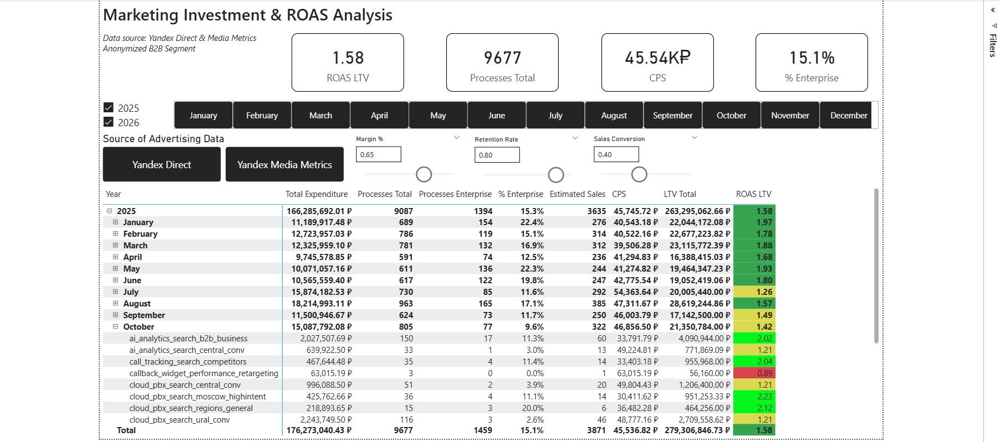
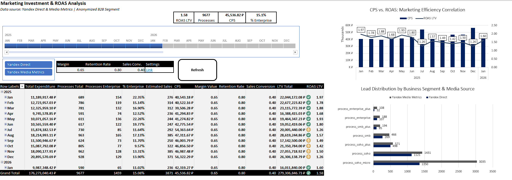
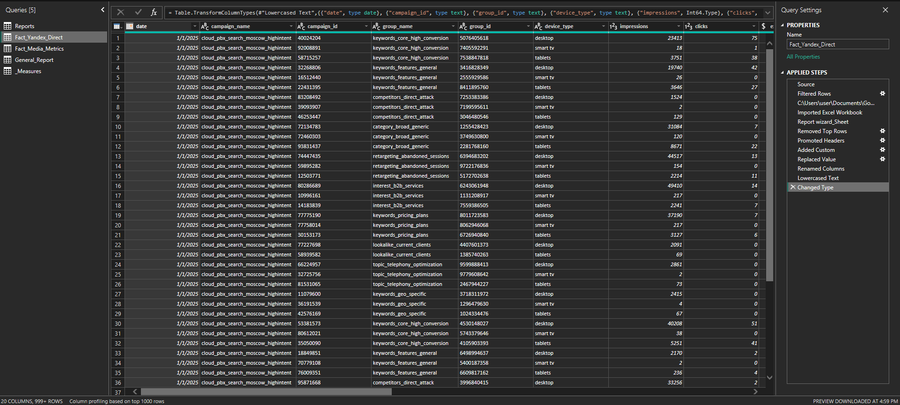

[Read in English](README.md) | [Читать на русском языке](README.ru.md)
# B2B Marketing ROAS & LTV Analysis Dashboard

## 📊 Project Overview
This repository contains a dual-tool marketing analysis project (Excel + Power BI). It integrates performance data from **Yandex Direct** and brand metrics from **Yandex Media Metrics** to calculate a multi-layered ROAS based on predicted LTV.

### Key Features:
* **Unified Data Model:** Seamlessly merging siloed sources via Power Query.
* **Predictive LTV:** Dynamic modeling using Retention, Margin, and Sales Conversion rates.
* **Sensitivity Analysis:** Interactive "What-if" parameters to test different business scenarios.

---

## 🖼️ Dashboard Previews

### 1. Power BI Executive View
The main BI interface for high-level decision making.

### 2. Interactive Excel Tool
A portable version of the model with VBA-powered refresh logic and form controls.

### 3. Data Transformation (ETL)
A glimpse into the clean, parameterized Power Query structure used to process raw data.

---

## 🛠️ Tech Stack
* **Tools:** Microsoft Power BI, Excel (Power Pivot).
* **Languages:** M (Power Query), DAX, VBA (Automation).
* **Methodology:** Unit Economics, Cohort-based LTV calculation.

---

## 🚀 How to Run & Refresh Data
To make the files work on your local machine:

1. **Clone/Download** this repository.
2. **Locate Data:** Find the absolute path to the `/data` folder on your drive.
3. **Update Path:**
   - In **Power BI**: Go to `Transform Data` -> `Edit Parameters` and paste your folder path into the `FolderPath` variable.
   - In **Excel**: Open Power Query Editor, find the `FolderPath` parameter in the queries list, and update its value.
4. **Refresh:** Click "Refresh All" (Excel) or "Refresh" (Power BI) to see the magic happen.

---

## 🧠 Analytical Insights
The model reveals how high-cost Enterprise acquisition channels can be more profitable than cheap SOHO leads when viewed through the lens of a 12-month LTV with a 0.8 Retention Rate.
